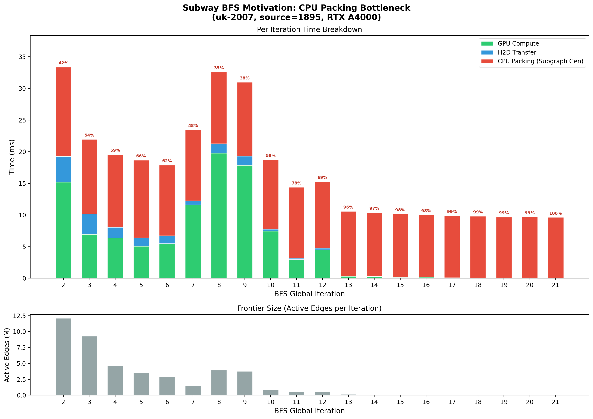
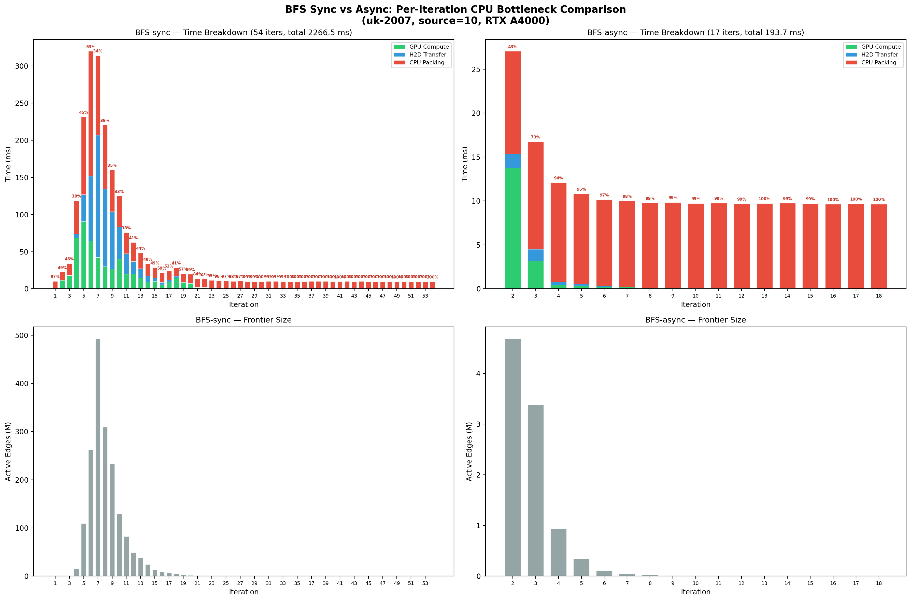
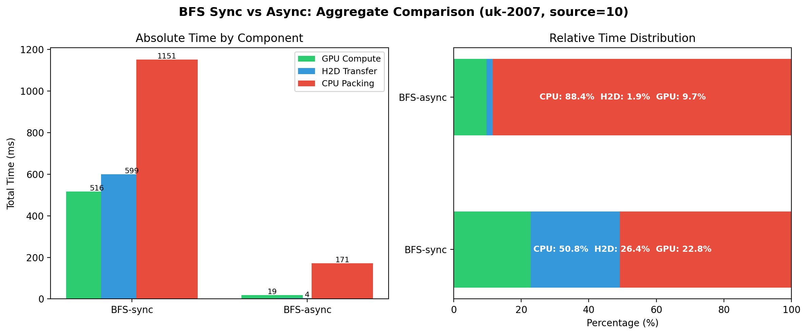

# Subway Motivation Experiment: CPU Packing Bottleneck

## 目的

驗證 Subway 框架中 CPU subgraph generation（打包）是 BFS 迭代的主要瓶頸，藉此佐證 Dense Bypass 機制的必要性。

## 實驗環境

| 項目 | 規格 |
|---|---|
| GPU | NVIDIA RTX A4000 (sm_86, 16GB VRAM) |
| Dataset | uk-2007.bcsr (105M nodes, 3.3B edges, 13GB) |
| Algorithm | BFS-sync / BFS-async |

## 實驗方法

### Subway BFS 每個 global iteration 的三個階段

1. **CPU Packing**（`SubgraphGenerator::generate`）：在 GPU 上執行 prefix scan 建立 active node/edge 列表，再以 CPU 多執行緒（64 threads）將活躍邊從完整 CSR 複製到連續的 `activeEdgeList` 緩衝區。
2. **H2D Transfer**：`cudaMemcpy` 將打包好的 subgraph edge list 從 host 傳到 device。若 subgraph 過大會分成多個 partition，每個 partition 各做一次 H2D。
3. **GPU Compute**：執行 BFS kernel 進行 relaxation。
   - **BFS-sync**（`bfs_kernel`）：每個 global iteration 僅執行一次 kernel launch，每次只展開一層 frontier（level-synchronous）。
   - **BFS-async**（`bfs_async`）：每個 partition 內透過 inner iteration 反覆執行 kernel 直到收斂，一次 global iteration 可展開多層。

### Sync vs Async 的核心差異

| 特性 | BFS-sync | BFS-async |
|---|---|---|
| Kernel | `bfs_kernel` + `moveUpLabels` | `bfs_async` + `mixLabels` |
| Inner iteration | 無（每次 1 層） | 有（收斂才停） |
| Global iterations | 多（= BFS 直徑） | 少（inner iter 補償） |
| CPU Packing 次數 | 多 | 少 |

### Instrumented 版本

建立 `subway/bfs-async-profile.cu` 和 `subway/bfs-sync-profile.cu`，在三個階段分別以 `std::chrono::high_resolution_clock` 計時，每個 global iteration 輸出一筆 CSV：

```
gItr, numActiveNodes, numActiveEdges, cpuPackingMs, h2dMs, gpuComputeMs
```

### 編譯與執行

```bash
cd Subway

# 確保 shared objects 已編譯 (sm_86)
make make1 NFLAGS=-arch=sm_86

# 編譯 async profiler
nvcc -c subway/bfs-async-profile.cu -o subway/bfs-async-profile.o -std=c++11 -O3 -arch=sm_86
nvcc subway/bfs-async-profile.o shared/timer.o shared/argument_parsing.o shared/graph.o \
     shared/subgraph.o shared/partitioner.o shared/subgraph_generator.o shared/gpu_kernels.o \
     shared/subway_utilities.o shared/test.o -o bfs-async-profile -std=c++11 -O3 -arch=sm_86

# 編譯 sync profiler
nvcc -c subway/bfs-sync-profile.cu -o subway/bfs-sync-profile.o -std=c++11 -O3 -arch=sm_86
nvcc subway/bfs-sync-profile.o shared/timer.o shared/argument_parsing.o shared/graph.o \
     shared/subgraph.o shared/partitioner.o shared/subgraph_generator.o shared/gpu_kernels.o \
     shared/subway_utilities.o shared/test.o -o bfs-sync-profile -std=c++11 -O3 -arch=sm_86

# 執行
./bfs-async-profile --input /path/to/datasets/KONECT/uk-2007.bcsr --source 10
./bfs-sync-profile  --input /path/to/datasets/KONECT/uk-2007.bcsr --source 10
```

### 繪圖

```bash
cd Subway/experiments

# 單一模式 (async only, source=1895)
python3 plot_motivation.py bfs_profile_uk2007_source1895.csv motivation_cpu_bottleneck.png

# Sync vs Async 比較 (source=10)
python3 plot_sync_vs_async.py \
    bfs_sync_profile_uk2007_source10.csv \
    bfs_async_profile_uk2007_source10.csv \
    sync_vs_async
```

---

## 實驗一：BFS-async (source=1895)

> 使用高 out-degree 節點 1895（out-degree 247,162）作為 BFS root。

### 總體時間分布

| 指標 | 數值 |
|---|---|
| BFS 迭代數 | 21 |
| 總處理時間 | 1.71 s |
| **CPU Packing 占比** | **64.2%** |
| H2D Transfer 占比 | 4.8% |
| GPU Compute 占比 | 31.0% |

### Per-Iteration 數據（排除 Iteration 1 初始化）

| Iter | Active Nodes | Active Edges | CPU Pack (ms) | H2D (ms) | GPU (ms) | CPU% |
|-----:|-------------:|-------------:|--------------:|----------:|---------:|-----:|
| 2 | 48,195 | 12,100,533 | 14.08 | 4.07 | 15.20 | 42.2% |
| 3 | 469,808 | 9,265,637 | 11.76 | 3.26 | 6.93 | 53.6% |
| 4 | 168,939 | 4,622,575 | 11.51 | 1.68 | 6.39 | 58.8% |
| 5 | 147,128 | 3,543,927 | 12.24 | 1.35 | 5.07 | 65.6% |
| 6 | 51,133 | 2,950,632 | 11.14 | 1.25 | 5.50 | 62.3% |
| 7 | 56,256 | 1,526,877 | 11.20 | 0.63 | 11.63 | 47.7% |
| 8 | 121,000 | 3,970,584 | 11.33 | 1.52 | 19.75 | 34.7% |
| 9 | 137,922 | 3,759,021 | 11.70 | 1.43 | 17.85 | 37.8% |
| 10 | 39,342 | 862,286 | 10.95 | 0.33 | 7.44 | 58.5% |
| 11 | 24,478 | 519,177 | 11.20 | 0.21 | 2.97 | 77.9% |
| 12 | 22,458 | 503,780 | 10.50 | 0.23 | 4.53 | 68.8% |
| 13 | 15,189 | 163,323 | 10.19 | 0.08 | 0.31 | 96.3% |
| 14 | 5,628 | 127,982 | 10.07 | 0.03 | 0.28 | 97.0% |
| 15 | 4,226 | 71,343 | 10.00 | 0.02 | 0.14 | 98.4% |
| 16 | 2,760 | 47,724 | 9.83 | 0.02 | 0.17 | 98.1% |
| 17 | 1,373 | 28,696 | 9.76 | 0.02 | 0.09 | 98.9% |
| 18 | 494 | 7,502 | 9.71 | 0.01 | 0.08 | 99.1% |
| 19 | 291 | 2,998 | 9.61 | 0.01 | 0.06 | 99.3% |
| 20 | 111 | 902 | 9.62 | 0.01 | 0.06 | 99.3% |
| 21 | 21 | 81 | 9.59 | 0.01 | 0.03 | 99.6% |

### 圖表



---

## 實驗二：BFS-sync vs BFS-async (source=10)

> 使用 source=10（out-degree 494）比較 sync 和 async 兩種 BFS 策略。

### 總體比較

| 指標 | BFS-sync | BFS-async |
|---|---|---|
| Global iterations | 54 | 17 (排除 iter 1 初始化) |
| 總處理時間 | 2266.5 ms | 193.7 ms |
| CPU Packing | 1151.0 ms (**50.8%**) | 171.3 ms (**88.4%**) |
| H2D Transfer | 599.3 ms (26.4%) | 3.6 ms (1.9%) |
| GPU Compute | 516.2 ms (22.8%) | 18.8 ms (9.7%) |
| Peak frontier | 492.8M edges (iter 7) | 4.7M edges (iter 2) |
| Avg CPU Pack/iter | 21.31 ms | 10.08 ms |

### BFS-sync Per-Iteration 數據（關鍵 iterations）

| Iter | Active Nodes | Active Edges | CPU Pack (ms) | H2D (ms) | GPU (ms) | CPU% |
|-----:|-------------:|-------------:|--------------:|----------:|---------:|-----:|
| 1 | 1 | 494 | 9.94 | 0.01 | 0.27 | 97.3% |
| 2 | 494 | 53,227 | 10.95 | 0.03 | 11.39 | 48.9% |
| 3 | 50,932 | 601,282 | 15.80 | 0.25 | 18.07 | 46.3% |
| 4 | 213,322 | 15,185,170 | 44.56 | 5.25 | 68.76 | 37.6% |
| 5 | 1,958,992 | 109,636,325 | 104.26 | 36.57 | 90.59 | 45.0% |
| **6** | **5,880,030** | **261,705,615** | **168.16** | **87.16** | **64.60** | **52.6%** |
| **7** | **14,051,094** | **492,796,450** | **107.34** | **164.55** | **42.18** | **34.2%** |
| 8 | 9,161,985 | 309,329,355 | 86.15 | 104.21 | 30.10 | 39.1% |
| 9 | 7,687,168 | 232,858,633 | 55.87 | 77.54 | 26.66 | 34.9% |
| 10 | 4,371,399 | 129,720,232 | 41.70 | 43.26 | 39.91 | 33.4% |
| ... | ... | ... | ... | ... | ... | ... |
| 30 | 236 | 4,648 | 9.86 | 0.01 | 0.03 | 99.6% |
| 40 | 3 | 13 | 9.83 | 0.01 | 0.02 | 99.7% |
| 54 | 1 | 2 | 9.76 | 0.00 | 0.01 | 99.9% |

### BFS-async Per-Iteration 數據（排除 Iteration 1 初始化）

| Iter | Active Nodes | Active Edges | CPU Pack (ms) | H2D (ms) | GPU (ms) | CPU% |
|-----:|-------------:|-------------:|--------------:|----------:|---------:|-----:|
| 2 | 31,535 | 4,687,806 | 11.67 | 1.59 | 13.77 | 43.2% |
| 3 | 146,974 | 3,382,316 | 12.26 | 1.34 | 3.16 | 73.2% |
| 4 | 41,633 | 934,999 | 11.31 | 0.36 | 0.41 | 93.6% |
| 5 | 14,511 | 342,028 | 10.27 | 0.16 | 0.37 | 95.1% |
| 6 | 5,211 | 115,122 | 9.85 | 0.07 | 0.24 | 97.0% |
| 7-18 | 1-2,240 | 2-49,885 | ~9.6-9.8 | <0.02 | <0.21 | >97% |

### 圖表





---

## 關鍵發現

### 1. CPU Packing 是兩種模式共同的瓶頸

- **BFS-sync**: CPU Packing 占總時間 **50.8%**（1151 ms / 2267 ms）
- **BFS-async**: CPU Packing 占總時間 **88.4%**（171 ms / 194 ms）
- 兩種模式下 CPU Packing 都是第一大時間開銷

### 2. CPU Packing 存在 ~10ms 的固定基礎開銷

無論 frontier 大小，每次 `SubgraphGenerator::generate` 都至少花費 ~10ms，源自：
- GPU prefix scan（`thrust::exclusive_scan`，兩次，掃描全部 105M 節點）
- D2H copy（`activeNodes` / `activeNodesPointer`）
- CPU thread 啟動開銷

Sync 模式在 frontier 爆發期（iter 5-7）CPU Packing 可達 100-170ms（因為要複製上億條邊），但在收斂尾端（iter 30-54）同樣只剩 ~10ms 的固定底線。

### 3. Async 大幅減少 global iterations，但放大了 CPU 占比

| | BFS-sync | BFS-async |
|---|---|---|
| Global iters | 54 | 17 |
| 總 CPU Pack 時間 | 1151 ms | 171 ms |
| CPU Pack 占比 | 50.8% | 88.4% |

Async 的 inner iteration 讓 GPU 在一次 subgraph 上做更多工作，減少了 global iteration 次數（54→17）和總 CPU Packing 時間（1151→171 ms）。但因為 GPU Compute 和 H2D 同比減少得更多（frontier 更小），CPU Packing 的**相對占比反而從 51% 上升到 88%**。

### 4. Sync 在 frontier 爆發期 H2D 成為瓶頸

BFS-sync iter 7 的 frontier 達 4.93 億條邊，H2D 傳輸耗時 165ms（占該 iteration 52%）。而 BFS-async 因 inner iteration 收斂，frontier 最大僅 470 萬條邊，H2D 幾乎可忽略。

### 5. 長尾 iterations 浪費嚴重

BFS-sync 的 iter 23-54（共 32 個 iteration）frontier 均小於 50 萬條邊，每次 GPU 計算 <0.3ms，但每次仍需 ~10ms 的 CPU Packing。這 32 個 iteration 共消耗了 ~320ms CPU Packing 時間，卻只做了 <10ms 的有效 GPU 計算。

## 結論

Subway 的 CPU subgraph generation 是 BFS 的核心效能瓶頸，在兩種執行模式下均占最大時間比例。其 ~10ms 的固定開銷在 frontier 較小時尤為致命——**Dense Bypass 機制**可跳過 CPU 打包、直接在 GPU 上處理完整鄰接結構，對以下場景有顯著加速潛力：

1. **BFS-async 的大多數 iteration**（iter 4+ CPU 占比 >93%）
2. **BFS-sync 的收斂尾端**（iter 23+ CPU 占比 >97%）
3. **BFS-sync 的 frontier 爆發期**（iter 5-7），若能避免 CPU 打包也能同時消除 H2D 瓶頸

---

## 檔案清單

| 檔案 | 說明 |
|---|---|
| `bfs_profile_uk2007_source1895.csv` | 實驗一原始數據 (async, source=1895) |
| `motivation_cpu_bottleneck.png` | 實驗一堆疊長條圖 |
| `bfs_async_profile_uk2007_source10.csv` | 實驗二 async 原始數據 (source=10) |
| `bfs_sync_profile_uk2007_source10.csv` | 實驗二 sync 原始數據 (source=10) |
| `sync_vs_async_breakdown.png` | 實驗二 per-iteration 分解圖 |
| `sync_vs_async_aggregate.png` | 實驗二總體比較圖 |
| `plot_motivation.py` | 單一模式繪圖腳本 |
| `plot_sync_vs_async.py` | Sync vs Async 比較繪圖腳本 |
| `experiment_log.txt` | 實驗執行記錄 |
| `../subway/bfs-async-profile.cu` | Instrumented BFS-async 原始碼 |
| `../subway/bfs-sync-profile.cu` | Instrumented BFS-sync 原始碼 |
